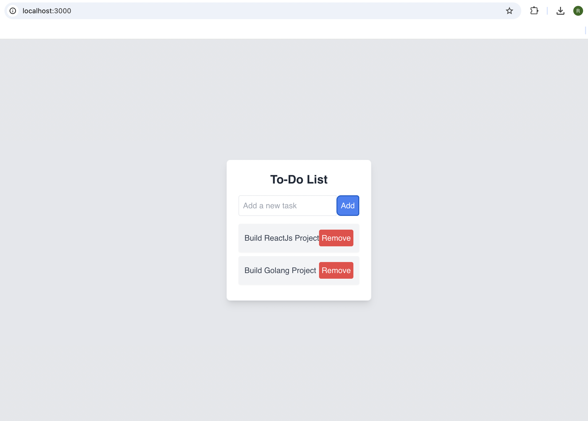

# Todo App using ReactJS + Vite

A simple todo application built with React.js and Vite. 

## Key Features

- **Add Cards:** Easily create new todo cards by providing a description.
- **Delete Cards:** Remove unwanted cards from the list with a single click.

## Technologies Used

- React.js: A JavaScript library for building user interfaces.
- Vite: A fast and minimalist build tool for modern web development.

## Getting Started

### 1. Clone the Repository

```sh
git clone https://github.com/rohayamnx/simple-todo-app.git
```

### 2. Navigate to the Project

```sh
cd your-repo
```

### 3. Install Dependencies

```sh
npm install
```

### 4. Run the Development Server

```sh
npm run dev
```

### 5. Open your browser and navigate to

```sh
http://localhost:3000
```

 # What You Should See

 Below is an example of the output you should see:


